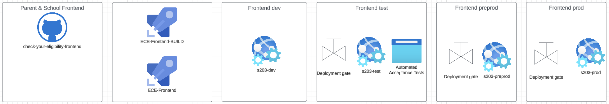

# Check Your Eligibility Frontend
This repo contains the user-facing parts for Eligibility Checking Engine (ECE) and the Check Free School Meals (FSM) service.

## Setup
This is a .NET 8 project - you'll need the latest .NET SDK etc to run it locally.

### Config
When you first clone the repo, you'll want to define your own config. You'll want to copy up the
file [appsettings.json](CheckYourEligibility-Parent/appsettings.json), name the copy `appsettings.Developmnent.json`
in the same folder. Update the values in this new file as needed. This file should not be committed, nor will it with our .gitignore.

## How to run tests
We have two test-suites - one .NET NUnit for unit tests and one Cypress for integration and e2e tests. Cypress needs a running application responding to http calls.

### .NET
VisualStudio does most of this for you, there'll be a button in your UI. Correctly set up Rider too.
`
cd CheckYourEligibility-Parent.Tests
dotnet test
`

### Cypress Testing

There is a full breakdown of how to set up and run the Cypress tests along with our current standards for Cypress testing 
within the tests folder.

## Ways of working
### Releasing code
We submit PRs into `main` for functioning code. The reviewer checks that the automated tests pass, then approve.

We expect the code reviewer to run the code locally, read through it and understand what it is trying to solve.

If approved, the original code-creator merges the PR and deletes the branch.

### Secrets
We don't commit active secrets to this repo. If we do, it is crucial to notify DM/TL/PO, rewrite git history and follow DfE processes.

## Resources
### Deployment

