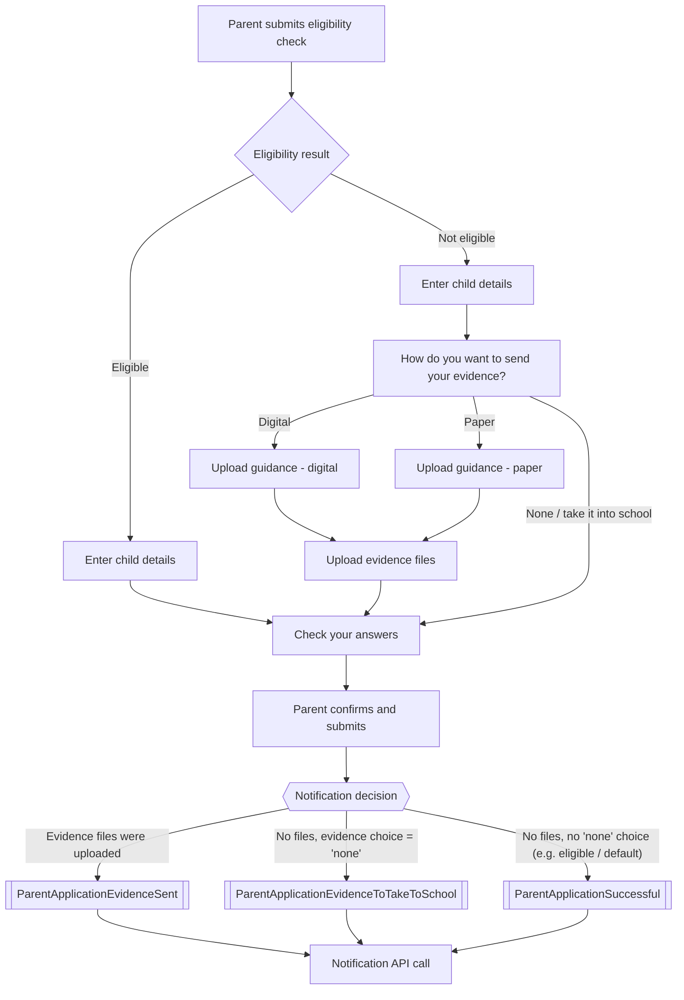

# Parent Application Notification Scenarios

This document explains **when** a notification is sent to a parent after submitting an
FSM/2YO/EYPP application, and **which** notification type is used in each case.

Source: `Check_Answers_Post` and `GetNotificationType` in
[CheckYourEligibility.FrontEnd/Controllers/CheckController.cs](../CheckYourEligibility.FrontEnd/Controllers/CheckController.cs)

## Where the decision is made

A notification is sent once, at the end of the journey, when the parent submits the
application on the "Check your answers" page (`Check_Answers_Post`). The notification
type is chosen using two pieces of information gathered earlier in the journey:

1. **Evidence files** - has the parent actually uploaded any evidence
   (`request.Evidence.EvidenceList`)?
2. **Evidence choice** - what did the parent pick on the "How do you want to send your
   evidence?" screen (`Upload_Evidence_Type`): `digital`, `paper`, or `none` ("take it
   into school")?

## Journey overview

## Decision table

| Eligibility path | Evidence choice (`Upload_Evidence_Type`) | Evidence files actually uploaded? | Notification sent |
|---|---|---|---|
| Eligible | n/a (evidence step is skipped) | No | `ParentApplicationSuccessful` |
| Not eligible | Digital | Yes | `ParentApplicationEvidenceSent` |
| Not eligible | Paper | Yes | `ParentApplicationEvidenceSent` |
| Not eligible | Digital or Paper | No (parent backed out / uploaded nothing) | `ParentApplicationSuccessful` |
| Not eligible | None ("take it into school") | No | `ParentApplicationEvidenceToTakeToSchool` |

> **Rule of precedence:** if evidence files are present, `ParentApplicationEvidenceSent`
> always wins - even if the parent's original choice was "none" (e.g. they changed their
> mind and uploaded evidence later in the journey).

## Notification types

Defined in
[CheckYourEligibility.FrontEnd/Domain/Enums/NotificationType.cs](../CheckYourEligibility.FrontEnd/Domain/Enums/NotificationType.cs):

| Enum value | Meaning | Currently used? |
|---|---|---|
| `ParentApplicationEvidenceSent` | Parent uploaded evidence with their application | ✅ Yes |
| `ParentApplicationSuccessful` | Application submitted with no evidence step needed (e.g. eligible outcome) | ✅ Yes |
| `ParentApplicationEvidenceToTakeToSchool` | Parent chose to take evidence into school rather than upload it | ✅ Yes |
| `ParentApplicationUnsuccessful` | *(reserved)* | ❌ Not wired into `GetNotificationType` yet |

## Open question for the business

`ParentApplicationUnsuccessful` exists as an enum value but is not currently sent by the
frontend in any scenario. If there is a business need to notify a parent specifically
when their application is unsuccessful (as opposed to just "not eligible" continuing to
the evidence flow), this logic still needs to be defined and implemented.
